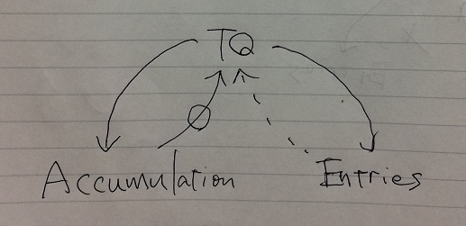

Theory.
Fluctuation is expressed by 3 forms: tq, entries and accumulates.
Those 3 forms are equivalent. thus there are conversions between them.
I described these conversions in an abstract class Building (and BuildingR afterward) in which we can see endless recursive calls.
That's why it is declared abstract. Hampering it from being instantiated unless it gets the end to the recursive calls.

Before moving on, consider about a simpler case in which there are 3 conversions between 3 forms which are forming triangle like this.


3 forms of an information is A,B and C in this example, and they are exchanged each other through 3 conversions ab,bc and ca.
This situation can be programmed like this.
```java
abstract class Conversions {
  B ab() {
    ...
    A a=ca();
    ...
  }
  C bc() {
    ...
    B b=ab();
    ...
  }
  A ca() {
    ...
    C c=ca();
    ...
  }
}
```
This program doesn't work because the recursion doesn't come to the end.
But when you have a value of one of 3 forms, you can easily cease this endless nightmare.
Let's say it was a value of A.
```java
class ConversionsFromA extends Conversions {
  A a;
  ConversionsFromA(A a) {
    this.a=a;
  }
  A ca() {
    return a;
  }
}
```
That's it. For this class, other part of the program (meaning ab() and bc()) works correctly.
In this way, you can make ConversionsFromB and ConversionsFromC.
Any source of data in any one of these forms can end the endless recursion.
Generally, you can make conversions between as many forms as you like by adding vertex to the scheme.

This is the basic idea behind Building class in Builder class.
Of course, I could code the way circulated if I do not care about victimizing performance.
If you take a look at the 3 forms in focus: tq, entries and accumulates, you will notice one thing.
The conversion between tq and entries are reasonably easy in either way.
But Accumulates has some redundant information which takes some cost for conversion.
Because of that demanding cost, I wanted to avoid the conversions from and to Accumulates as far as possible.
As long as using the circulated conversions shown in class Conversions, it's impossible to avoid a wasteful detour go through Accumulations.
So to avoid this wasteful detour, class Builder has this structure.


Of course, the conversion route back from Accumulates is needed.
By adding that path to BuildingR, a subclass of Building, makes everything perfect.
And it's really easy.



A decision though simple is needed to make use of these.
Which form of data do you start from?.
If it's in the form of tq or entries, you can use Building class.
If it takes the form of Accumulations, then it should be BuildingR class.
